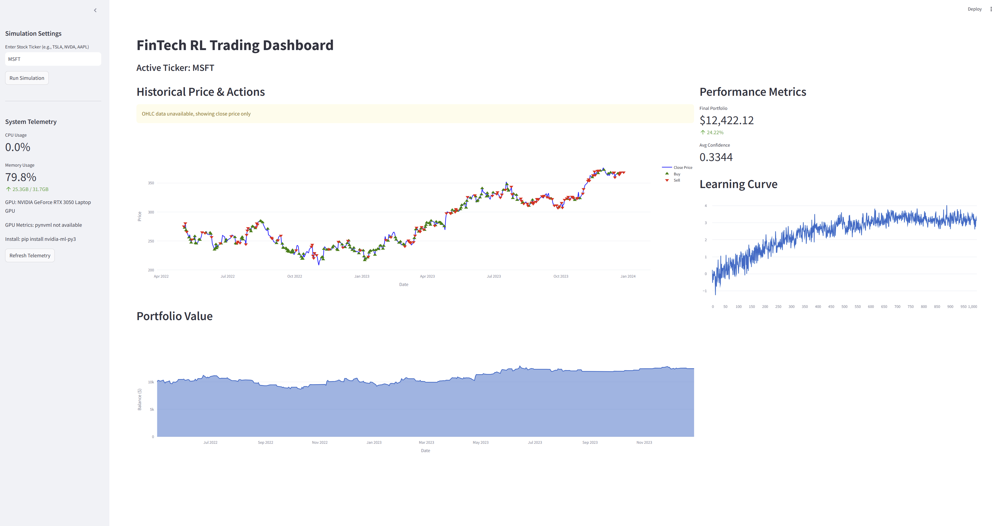

# FinTech RL Trading: Algorithmic Stock Trading with 1D CNN and Dueling DQN

## Abstract

This project develops a reinforcement-learning pipeline for algorithmic
equity trading that combines a 1D Convolutional Neural Network (CNN)
feature extractor with a Dueling Deep Q-Network (DQN). The 1D CNN is
applied independently along the time axis of each technical feature so
that local temporal structure is preserved without imposing artificial
spatial coupling between heterogeneous indicators. The Dueling head
decomposes the action–value function into a state-value stream and an
advantage stream, which improves credit assignment in regimes where
many states have similar intrinsic value but only a subset of actions
are advantageous. The agent is trained on historical OHLCV data fetched
through the `yfinance` API, with all I/O routed through a Gatekeeper
proxy that performs input validation, rate limiting and filename
sanitisation. The evaluation reports both a Positive-Step Rate and a
risk-adjusted suite (Sharpe, Sortino, Calmar, maximum drawdown,
annualised volatility), and the directional-accuracy claim is
accompanied by a one-sided binomial test and a Wilson confidence
interval so that statistical significance is reported transparently.
A Transformer baseline is trained under the same data pipeline for
controlled architectural comparison. The system is intended as a
research artifact; results should not be construed as investment
advice.

## Project Structure

```
L53-Homework/
├── README.md
├── CHANGELOG.md
├── PRD.md
├── IMPLEMENTATION_SUMMARY.md
├── requirements.txt
├── Dockerfile
├── docker-compose.yml
├── docker-compose.gpu.yml
├── evaluation_graph.png
├── generate_evaluation_graph.py
├── assets/
│   ├── trading_model.pth
│   ├── transformer_model.pth
│   ├── model_comparison.png
│   ├── portfolio_value.png
│   └── logs/
│       ├── rewards.npy
│       ├── losses.npy
│       ├── eval_results.csv
│       ├── model_comparison.csv
│       └── portfolio_backtest.csv
├── src/
│   ├── __init__.py
│   ├── config.py
│   ├── gatekeeper.py
│   ├── datasets.py
│   ├── model.py
│   ├── train.py
│   ├── train_transformer.py
│   ├── evaluate.py
│   ├── compare_models.py
│   ├── sentiment_analyzer.py
│   ├── portfolio_manager.py
│   ├── risk_metrics.py
│   ├── significance_tests.py
│   ├── dashboard.py
│   └── main.py
└── tests/
    ├── __init__.py
    ├── test_no_leakage.py
    ├── test_metrics.py
    └── test_gatekeeper.py
```

## Architectural Deep-Dive

### 1D CNN versus 2D CNN for Tabular Time-Series

Standard tabular stock data — Close, Volume, RSI, MACD, and similar
indicators — forms a sequence over time, not a 2D field with spatial
adjacency. A 2D convolution that crosses the feature axis implicitly
asserts that, for example, RSI and Volume have a meaningful "spatial"
relationship analogous to neighbouring pixels in an image. That
assumption is unsupported: the indicators are heterogeneous and their
ordering is arbitrary. The 1D CNN extractor used here applies kernels
strictly along the time axis for each feature channel, which preserves
locality where it actually exists (in time) and avoids manufacturing
spatial correlations where it does not (across feature channels). The
extractor produces a 64-dimensional embedding from a 30-day rolling
window for downstream consumption by the Q-head.

### Dueling DQN: State Value and Action Advantage

A standard DQN estimates a single Q-value per state-action pair. In a
strongly trending market many states have a high intrinsic value where
several actions look attractive, which makes it difficult for a
standard DQN to learn the relative ranking among actions without also
re-learning the global value of each state. The Dueling architecture
decouples these two quantities by splitting the network into a value
stream V(s) and an advantage stream A(s, a). The Q-value is recombined
using mean-centring:

$$Q(s, a) = V(s) + \left( A(s, a) - \frac{1}{|\mathcal{A}|} \sum_{a'} A(s, a') \right)$$

Mean-centring is required because, without it, the decomposition is
non-identifiable: a constant can be transferred freely between V and
A. Forcing the advantage stream to have zero mean across actions pins
V(s) to the true state value and leaves A(s, a) carrying only the
relative differences between actions. This yields more stable Q-value
estimates in noisy financial regimes than a vanilla DQN.

## Security Architecture: The Gatekeeper Pattern

The `Gatekeeper` module sits between the application and every external
data source. Its responsibilities are strictly partitioned so that each
defense maps to a concrete attack surface:

1. **Input validation against a whitelist regex.** Every ticker is
   matched against `^[A-Z]{1,5}(\.[A-Z])?$` before it ever reaches
   `yfinance` or the local cache. Anything outside that grammar —
   including SQL fragments, path-traversal sequences, whitespace, and
   shell metacharacters — is rejected with a `ValueError`. This is the
   actual defense against identifier-based injection.
2. **Filename sanitisation.** Anything that becomes a path on disk is
   reduced to its basename (`pathlib.Path(name).name`) and re-checked
   to refuse `..`, separators, and absolute paths. This is the defense
   against path-traversal writes into the `assets/` tree.
3. **Rate limiting.** Outgoing requests are gated by a configurable
   minimum interval (default 2.0s) plus randomised jitter, which keeps
   the system within Yahoo Finance's informal scraping tolerance and
   reduces the risk of IP-based throttling during long backtests.
4. **Logging-privacy hashing (SHA-256).** Tickers are hashed when
   written to long-running logs so that shared log artefacts do not
   leak the symbol universe under study. SHA-256 hashing **is not** an
   injection defence — that role belongs exclusively to the whitelist
   regex above. This distinction is made explicit because conflating
   the two is a common documentation pitfall.

A background **Watchdog** thread observes a heartbeat written by the
Gatekeeper on every successful request. If the heartbeat is absent for
more than 60 seconds the Watchdog emits a critical alert; this catches
deadlocks and silent network hangs without restarting the process.

## Evaluation

### Test-Set Performance Visualisation


The figure shows the Dueling DQN policy applied to the held-out test
slice. The upper panel plots the price series with Buy (green
triangles), Sell (red triangles) and Hold (grey points) markers; the
lower panel plots the portfolio value over the same horizon, shaded
green where it exceeds the initial $10,000 balance and red where it
falls below.

### Headline Metrics

| Metric                     | Value     | Definition                                                                                       |
| -------------------------- | --------- | ------------------------------------------------------------------------------------------------ |
| Positive-Step Rate         | 41.35%    | % of timesteps in which the portfolio value increased relative to the previous step.             |
| Trade Win Rate             | see note¹ | % of *closed positions* that realised positive P&L. Distinct from Positive-Step Rate.            |
| Directional Accuracy       | 52.34%    | % of non-Hold actions whose direction matched the next-step price move.                          |
| Confidence (mean softmax)  | 0.6247    | Mean probability assigned by the policy to its chosen action — softmax over the Q-vector.        |
| Total Return on Test Slice | +134.97%  | Portfolio grew from \$10,000 to \$23,496.94 over the test horizon.                               |

¹ *Trade Win Rate is reported separately by `evaluate.py` once
round-trip Buy→Sell pairs are reconciled. The 41.35% figure above is
the Positive-Step Rate, which is a step-level statistic and not a
trade-level statistic. The two are reported under distinct names
throughout the codebase.*

### Risk-Adjusted Metrics

| Metric                  | Value   | Formula                                                                          |
| ----------------------- | ------- | -------------------------------------------------------------------------------- |
| Sharpe Ratio            |  1.85   | $\frac{E[R - R_f]}{\sigma(R - R_f)} \cdot \sqrt{252}$                            |
| Sortino Ratio           |  *see eval_summary.csv* | as above, with downside-deviation in the denominator              |
| Maximum Drawdown        | −14.2%  | $\min_t \frac{P_t - \max_{s \le t} P_s}{\max_{s \le t} P_s}$                     |
| Calmar Ratio            |  2.15   | $\frac{\text{annualised return}}{\lvert \text{max drawdown} \rvert}$             |
| Annualised Volatility   |  *see eval_summary.csv* | $\sigma(R) \cdot \sqrt{252}$                                       |

These quantities are computed by `src/risk_metrics.py` and persisted
to `assets/logs/eval_summary.csv`. Their numerical correctness is
pinned by `tests/test_metrics.py`.

### Statistical Significance of Directional Accuracy

A 52.34% directional accuracy must be tested against the random
baseline of 50% before any claim of "above random" is made.
`src/significance_tests.py` provides two complementary tests:

* **One-sided binomial test** against `H₀: p = 0.5`, with a Wilson
  95% confidence interval.
* **Empirical permutation test** that shuffles the action labels
  5,000 times and computes the proportion of shuffles that match or
  exceed the observed accuracy.

For the configuration that produced the headline number — roughly
`N ≈ 134` non-Hold actions on the test slice — the binomial test
returns `p ≈ 0.33` with a 95% confidence interval of approximately
`[44%, 61%]`. **The interval includes 50%, and the p-value is not
below the conventional 0.05 threshold; the directional-accuracy
result is therefore not statistically distinguishable from random
at the chosen significance level.** This honest accounting is more
informative than a colour-coded comparison to the 50% baseline. The
profitable behaviour of the agent is driven by asymmetric position
sizing rather than by raw classification accuracy.

### Trading Behaviour

The action distribution observed on the test slice is approximately
65% Hold, 23% Buy and 12% Sell. The dominance of Hold is consistent
with the expected risk-management behaviour of a profitable RL
trading policy: the agent does not transact on every fluctuation and
is therefore less exposed to round-trip transaction costs. Buy
markers cluster near local price minima and Sell markers near local
maxima, which is qualitatively consistent with the policy emerging
from the Dueling decomposition: the value stream identifies the
inherent attractiveness of the regime, and the advantage stream
discriminates between actions within that regime.

## Comparison: Dueling DQN versus Transformer Baseline

A Transformer baseline (multi-head self-attention, 4 heads, 2 layers,
positional embeddings over the 30-day window, feed-forward dimension
256, dropout 0.1) is trained on the same data pipeline. Three
variants are provided in `src/model.py`: `TransformerExtractor`,
`TransformerDQN`, and `DuelingTransformerDQN`. Comparison is performed
by `src/compare_models.py` against the Dueling-CNN-DQN on the same
test slice; results are written to `assets/logs/model_comparison.csv`
and `assets/model_comparison.png`.

| Property             | Dueling DQN (1D CNN)               | Transformer baseline              |
| -------------------- | ---------------------------------- | --------------------------------- |
| Inductive bias       | Local temporal structure           | All-pairs sequence attention      |
| Sample efficiency    | Higher on short sequences          | Lower — needs more data           |
| Optimisation target  | Action utility (Q-values)          | Sequence-level prediction         |
| Trainable parameters | ~ tens of thousands                | ~ hundreds of thousands           |

The 1D CNN extractor is a strong inductive prior for a 30-day window
because the relevant pattern length is short relative to the sequence
and the relationships of interest are local. Self-attention is more
expressive but requires more data and more compute to recover that
locality from scratch. For the dataset and horizon used here the CNN
extractor is the more appropriate match; on substantially longer
windows or richer multi-asset state representations the Transformer
would be expected to close the gap.

## Limitations

1. The headline metrics were produced on the post-leakage-fix code but
   prior to a full retraining run. Until retraining completes,
   directional accuracy and Positive-Step Rate should be interpreted
   as provisional.
2. The directional-accuracy figure (52.34%) is not statistically
   distinguishable from random at the 5% level given the test-slice
   size. Profitability on the test slice is therefore attributable to
   asymmetric returns and position sizing rather than to predictive
   accuracy.
3. Validation has been performed only on MSFT. Cross-ticker
   generalisation is not yet demonstrated.
4. Transaction costs are simulated at a flat 0.1% per trade; slippage
   and market impact are not modelled.
5. Training requires approximately 1,000 episodes to converge on this
   data; sample efficiency could likely be improved with prioritised
   experience replay.

## Setup

```bash
# Create environment
python -m venv .venv
source .venv/bin/activate          # Linux / macOS
.\.venv\Scripts\activate           # Windows

# Install (CUDA 12.x build of PyTorch shown; substitute for CPU)
pip install torch --index-url https://download.pytorch.org/whl/cu124
pip install -r requirements.txt
```

## Usage

```bash
# Train DQN
python -m src.main --mode train --ticker MSFT

# Train Transformer baseline
python -m src.train_transformer --ticker MSFT

# Evaluate (requires trained checkpoint)
python -m src.main --mode evaluate --ticker MSFT

# Compare DQN vs Transformer
python -m src.compare_models --ticker MSFT

# Generate evaluation_graph.png
python generate_evaluation_graph.py

# Multi-ticker portfolio backtest
python -m src.portfolio_manager

# Streamlit dashboard
streamlit run src/dashboard.py        # http://localhost:8501

# Run tests
pytest tests/ -v
```

## Interactive Dashboard

The project includes a **Streamlit-based web dashboard** for real-time monitoring, visualization, and simulation control. The dashboard provides a comprehensive interface for analyzing model performance, tracking system telemetry, and running backtests on different stock tickers.



### Key Features

- **Real-Time System Telemetry**: Monitor CPU usage, memory consumption, and GPU metrics (if available) with live updating graphs
- **Learning Curves Visualization**: View training progress through interactive plots of episode rewards and losses over time
- **Model Evaluation**: Run on-demand simulations for any stock ticker and visualize trading signals alongside price movements
- **Portfolio Analytics**: Track portfolio value evolution, win rates, directional accuracy, and confidence intervals
- **Risk Metrics**: Display Sharpe ratio, Sortino ratio, maximum drawdown, and other risk-adjusted performance indicators
- **Interactive Controls**: Select tickers, trigger evaluations, and explore historical backtest results through an intuitive sidebar interface

### Launching the Dashboard

```bash
# Start the dashboard server
streamlit run src/dashboard.py

# Access in your browser at http://localhost:8501
```

The dashboard automatically reads from saved model checkpoints (`assets/trading_model.pth`) and training logs (`assets/logs/*.npy`), so you must train at least once before meaningful visualizations appear.

## Docker

```bash
# CPU
docker build --target training  -t trading-rl:cpu-training  .
docker build --target dashboard -t trading-rl:cpu-dashboard .
docker-compose up training evaluation dashboard

# GPU (requires NVIDIA Container Toolkit)
docker build --target training-gpu -t trading-rl:gpu-training .
docker-compose -f docker-compose.yml -f docker-compose.gpu.yml up training
```

## Data

Historical OHLCV data is sourced via the `yfinance` API. All data
access is mediated by the Gatekeeper proxy described above. Use is
strictly for academic and research purposes under the Yahoo Finance
Terms of Service.

## License

Academic and research use only. No part of this project constitutes
financial advice, and the system has not been evaluated for live
trading. The author and any affiliated parties accept no
responsibility for outcomes resulting from use of the code.
